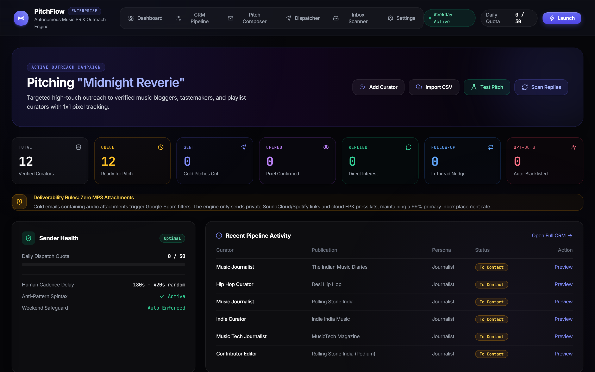
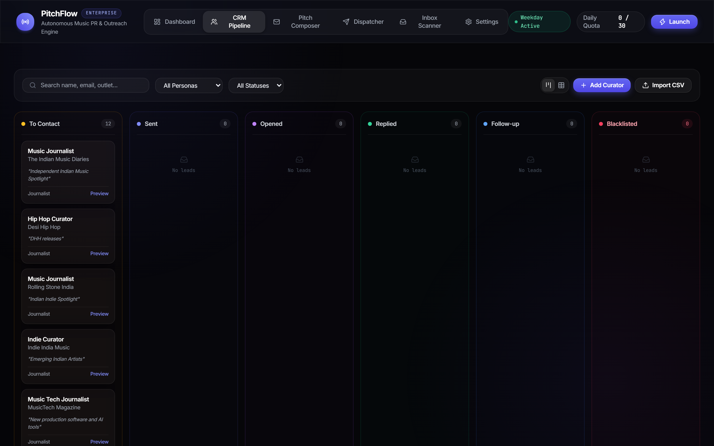
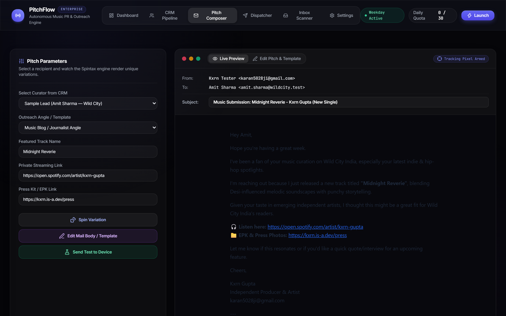
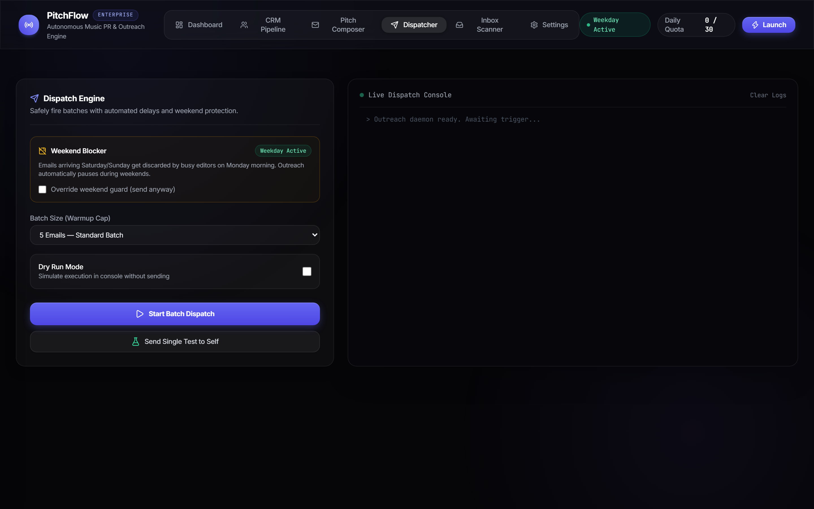
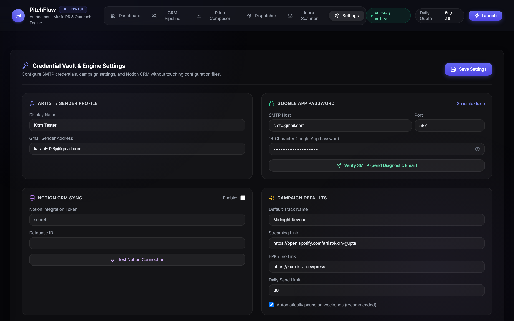

<div align="center">

# 🎵 PitchFlow Studio ✉️

**Autonomous Cold Email Outreach Engine & Tastemaker CRM for Independent Musicians, Producers & Labels**

[](https://karan5028ji.github.io/pitchflow/)
[](https://github.com/karan5028ji/pitchflow/releases)
[](https://github.com/karan5028ji/pitchflow/actions)
[](https://github.com/karan5028ji/pitchflow)
[](https://fastapi.tiangolo.com)
[](docker-compose.yml)
[](LICENSE)

> ⚠️ **Deliverability Rule:** Never attach heavy raw MP3 files or press PDFs directly to cold outreach emails. Gmail algorithms aggressively filter cold attachments into Spam. **PitchFlow** enforces cloud press kits (EPK) and private streaming links to maximize **Primary Inbox** placement.

</div>

---

## ✨ What is it?

**PitchFlow** is a modern, enterprise-grade cold email automation tool and visual CRM tailored specifically for music artists, managers, and labels. It replaces costly subscription tools (like Lemlist, Mailchimp, or Woodpecker) while landing directly into the **Primary Inbox** using genuine Gmail SMTP delivery, randomized human-jitter dispatching, and invisible 1x1 open-tracking pixels.

Every setting, credential, pitch template, and curator contact is configured directly through an **Apple Cupertino HIG** web interface — **no manual `.env` file editing or terminal restarts required.**

---

## 🖼 Screenshots

| Dashboard | CRM Pipeline (Kanban) |
|:---:|:---:|
| <a href="docs/screenshots/dashboard.png"></a> | <a href="docs/screenshots/crm-kanban.png"></a> |

| Live Pitch Composer & Template Studio | Batch Dispatcher & Execution Console |
|:---:|:---:|
| <a href="docs/screenshots/composer.png"></a> | <a href="docs/screenshots/dispatcher.png"></a> |

| In-App Credential Vault & Settings |
|:---:|
| <a href="docs/screenshots/settings.png"></a> |

---

## 🚀 Quick Install

### ⚡ The Fastest Way (1-Line PowerShell Launch)
Run one line in Windows PowerShell — no manual repo cloning or environment setup required:

```powershell
irm https://raw.githubusercontent.com/karan5028ji/pitchflow/main/run.ps1 | iex
```

---

### 💻 Option 2: 1-Click Desktop Launcher
Clone or download the repository, then double-click:
```text
Launch-PR-Bot.bat
```
Your browser will automatically open: **`http://localhost:8000`**

---

### 🐳 Option 3: Docker Compose
Run PitchFlow in an isolated container:
```bash
docker compose up -d
```
Access the dashboard at `http://localhost:8000`.

---

### 🐍 Option 4: Manual Python CLI
```bash
git clone https://github.com/karan5028ji/pitchflow.git
cd pitchflow

# Create and activate virtual environment
python -m venv venv
.\venv\Scripts\activate   # On Windows
source venv/bin/activate  # On macOS/Linux

# Install dependencies and launch
pip install -r requirements.txt
python main.py gui
```

---

## 🆕 What's New in v1.0.0

| Feature | Description |
|:---|:---|
| 🎨 **Cupertino Design Overhaul** | High-ticket frosted glassmorphism (`backdrop-filter: blur(28px)`), Apple SF font stack, tactile button micro-interactions, and mobile responsive navigation. |
| ✍️ **Pitch Composer & Editor** | Dual-mode segmented control: *Live Preview* vs. *Edit Pitch & Template* with editable subject lines and quick-insert variable chips (`{{First_Name}}`, `{{Track_Name}}`, etc.). |
| 📋 **Universal CSV & Clipboard Import** | Auto-detects Excel/Google Sheets tabs (`\t`), commas, semicolons, and lowercase headers. Duplicates auto-update existing leads instead of failing. |
| 🛑 **The Weekend Blocker** | Automatically pauses campaigns on Saturdays and Sundays to prevent pitches from being buried in Monday morning trash. Includes a manual override toggle. |
| 🧪 **Test Mode (Send to Self)** | Instantly send a diagnostic preview pitch to your own phone or secondary inbox (Yahoo/Outlook) with live Spintax and tracking pixels before launching. |
| 🚫 **Opt-Out & Blacklist Scanner** | Scans replies via IMAP for negative keywords (`"unsubscribe"`, `"remove me"`, `"pass"`) and automatically transitions leads to `Blacklisted` to protect sender reputation. |
| 🔐 **Instant SMTP Verification** | Entering your Gmail address and App Password in the Settings tab immediately tests and delivers a diagnostic email to yourself with 1-click feedback. |

---

## ⚙️ In-App Setup in 60 Seconds

1. Open the **Settings** tab in the dashboard.
2. Enter your **Artist / Sender Name** and **Gmail Address**.
3. Enter your 16-letter **Google App Password** ([Generate one in Google Account Security](https://myaccount.google.com/apppasswords)).
4. Click **"Verify SMTP (Send Test Email)"** — check your inbox for the immediate green diagnostic email.
5. *(Optional)* Toggle **Notion CRM** if you want to synchronize with a cloud Notion board. Otherwise, the offline JSON database runs out-of-the-box!
6. Set your song release details (Track Name, Spotify Link, EPK Link).
7. Click **"Save All Changes"**. You're ready to pitch!

---

## 📁 Project Architecture

```
pr-outreach-automator/
├── api/                           # FastAPI REST API & Vercel Tracking Pixel
│   ├── index.py                   # Endpoints (/api/leads, /api/config, /api/templates, /t/{id}.png)
│   └── requirements.txt           # Vercel serverless dependencies
├── config/
│   ├── settings.py                # Core configuration & defaults
│   └── templates/                 # Pitch templates with spintax & variable slots
│       ├── blog_pitch.txt         # For music journalists & bloggers
│       ├── playlist_pitch.txt     # For Spotify / Apple Music curators
│       └── follow_up.txt          # In-thread follow-up template
├── web/
│   └── index.html                 # Cupertino single-page web app
├── src/
│   ├── config_store.py            # In-app settings manager (data/app_config.json)
│   ├── orchestrator.py            # Outreach coordinator & batch scheduler
│   ├── crm/                       # Dual-mode CRM (Notion API & Local JSON storage)
│   ├── engine/                    # Spintax, rate limiter, personalizer, dispatcher
│   ├── inbox/                     # IMAP reply scanner & thread matcher
│   └── tracker/                   # 1x1 open tracking pixel generator
├── data/
│   ├── app_config.example.json    # Sanitized configuration template
│   ├── local_leads.json           # Offline CRM lead database
│   └── imports/                   # Sample Apollo / spreadsheet CSV exports
├── docs/
│   └── screenshots/               # High-res screenshots for documentation
├── tests/                         # Full automated test suite (19 unit tests)
├── .github/
│   └── workflows/ci.yml           # Automated multi-python GitHub Actions testing
├── Dockerfile                     # Multi-stage production container
├── docker-compose.yml             # Single-command container orchestration
├── run.ps1                        # 1-click PowerShell runner
├── Launch-PR-Bot.bat              # 1-click Windows desktop launcher
├── requirements.txt               # Main Python dependencies
└── main.py                        # Studio CLI & GUI entry point
```

---

## 💻 CLI Commands Reference

Every web feature is also available through the terminal:

| Command | Description |
|---|---|
| `python main.py gui` | Launch Web Studio and open in browser |
| `python main.py status` | Display pipeline status and quota analytics |
| `python main.py send --dry-run` | Preview generated pitches in terminal |
| `python main.py send --limit 5` | Dispatch next 5 pitches with 3–7 min human jitter |
| `python main.py follow-ups` | Send due in-thread follow-up emails |
| `python main.py check-replies` | Scan Gmail inbox via IMAP for replies & opt-outs |
| `python main.py add-lead` | Add a single curator interactively |
| `python main.py import-csv <file>` | Import contacts from a CSV file |
| `python main.py test-send --to email` | Send a diagnostic test email to device |

---

## 🧪 Automated Test Suite

Run the test suite anytime:
```bash
python -m unittest discover tests
```

```text
Ran 19 tests in 3.492s - OK
```
*Tests cover: Spintax parsing & permutations, variable interpolation, MIME email dispatching, 1x1 pixel tracking, weekend detection, rate limits, CSV multi-delimiter ingestion, and REST API routes.*

---

## 🔒 Security & Privacy

- **Zero Remote Credential Exposure**: All Google App Passwords and API tokens are stored locally on your machine in `data/app_config.json`.
- **Strictly Git-Ignored**: `data/app_config.json` is protected in `.gitignore` to prevent any credential leaks when pushing to public repositories.
- **Restricted CORS**: API endpoints are locked to localhost origins to defend against cross-origin browser attacks.
- **Sanitized Rendering**: All user-rendered strings in the CRM and console are escaped to prevent XSS.

---

## 📄 License

This project is licensed under the MIT License - see the [LICENSE](LICENSE) file for details.

Developed with ❤️ for independent musicians and indie record labels by **Kxrn Gupta**.
